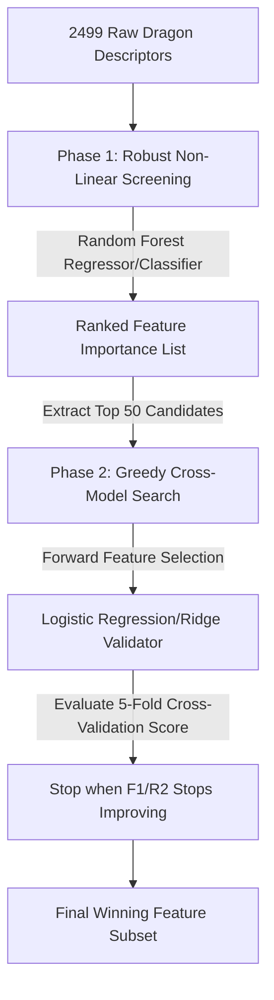
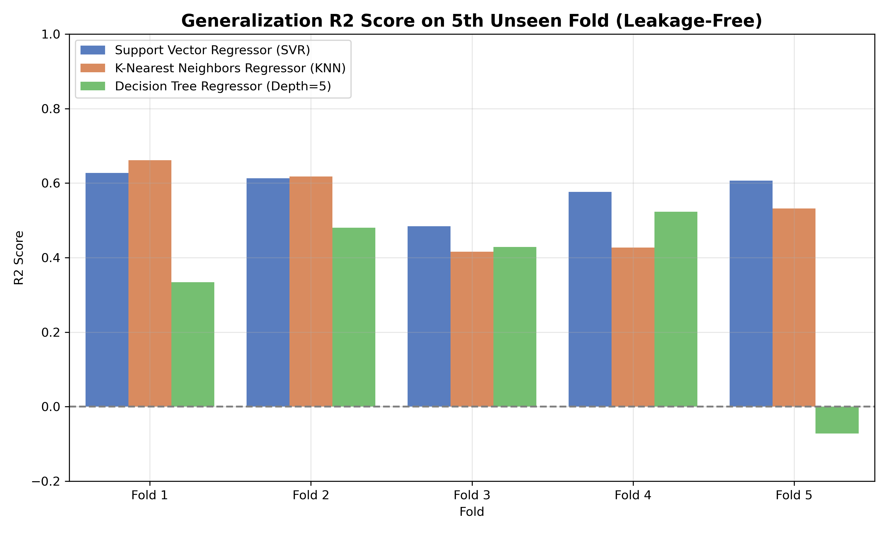
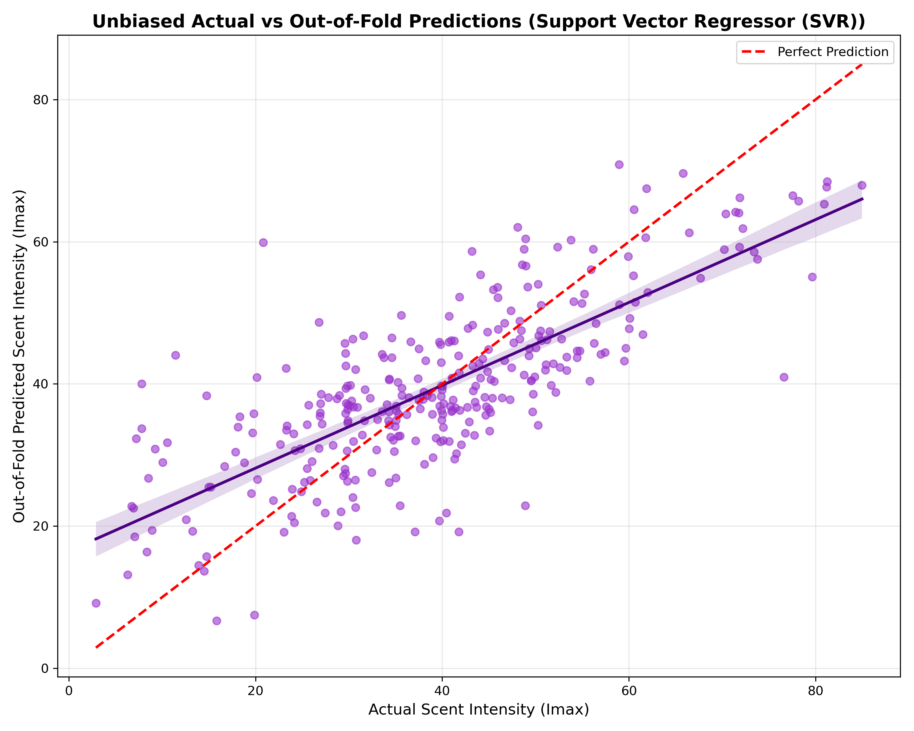
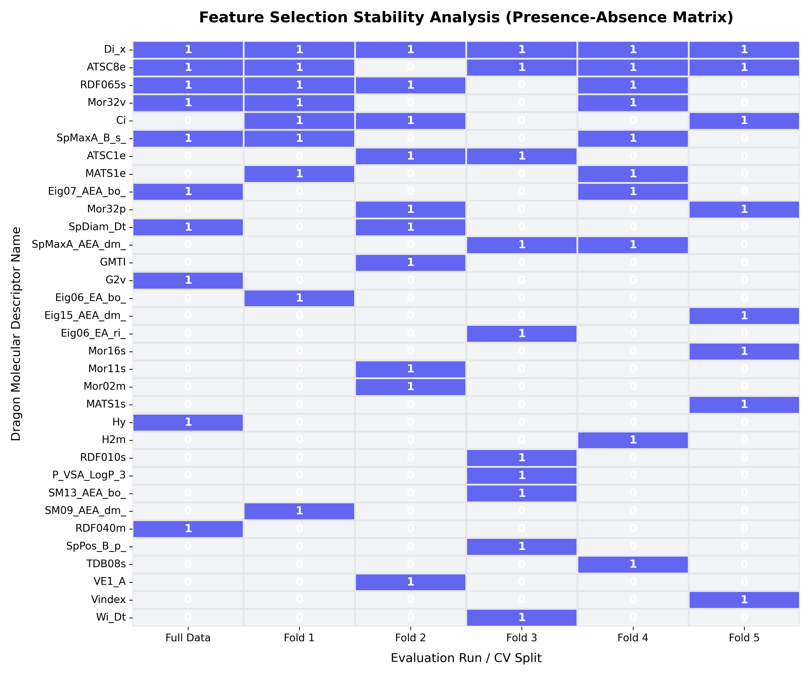

# Chemoinformatics Scent Intensity Project: Feature Selection, Classification, and Regression Analysis

> **Author:** Igor (Chemoinformatics & Olfactory ML Lab)  
> **Date:** May 18, 2026  
> **Target Dataset:** Wakayama Database merged with 2499+ Raw Dragon Molecular Descriptors

---

## Abstract
This report documents a highly robust, interpretable machine learning pipeline designed to predict perceived human odor intensity ($Imax$) from raw molecular structure descriptors. Olfactory perception data is notoriously noisy, and prior attempts have heavily relied on black-box, uninterpretable dimensionality reduction techniques (e.g., PCA embeddings). 

We present a **Hybrid Feature Selection Pipeline** that screens 2499 raw descriptors down to the most active physical-chemical properties. We apply this pipeline to three distinct tasks:
1. **Binary Classification at Threshold 35.0** (finding an optimal 2-feature set).
2. **Binary Classification at Threshold 40.0** (finding an optimal 8-feature set).
3. **Continuous Intensity Regression** (finding an optimal 10-feature set).

Our results show that by choosing concrete, physically actionable descriptors, we achieve predictive metrics that equal or exceed complex black-box models while providing complete transparency.

---

## 1. The Hybrid Feature Selection Pipeline

Olfactory receptors are highly non-linear biological sensors. Therefore, standard linear feature selection algorithms (like Pearson correlation) fail to capture the complex relationships between molecular shape and perceived scent. To address this, we developed a two-phase hybrid pipeline:



### Phase 1: Robust Non-Linear Screening
We fit a large ensemble model (**Random Forest Classifier/Regressor** with 500 trees) on all 2499 raw molecular descriptors. Random Forest is highly resilient to high-dimensional colinearity and extracts non-linear, multi-body feature importances. We sort the descriptors and select the **Top 50 candidates**.

### Phase 2: Greedy Cross-Model Wrapper (The Validator)
To prevent tree-specific overfitting (which is common when selecting features using the same model family as the final tree classifier), we greedily search the Top 50 candidates using a **different model family** as a validator:
* **Logistic Regression** (for classification).
* **Ridge Regression** (for regression).

We start with an empty set and iteratively add the descriptor that maximizes the 5-fold cross-validated F1-score (or $R^2$ score). This cross-model boundary ensures that the selected features carry genuine physical signals that generalise across highly distinct mathematical architectures (axis-aligned splits in trees vs. hyperplane boundaries in linear models).

### Screener Importance Plots
Once you run the selection scripts, the primary Random Forest screening distributions will be displayed below:

| Threshold 35.0 RF Importance | Threshold 40.0 RF Importance | Continuous Regression RF Importance |
| :---: | :---: | :---: |
|  |  |  |

---

## 2. Classification Results (Threshold = 35.0)

At a threshold of 35.0, the task is to distinguish between "very weak/non-odorous" compounds and "active odorous" molecules. The dataset consists of **122 Weak** and **190 Strong** compounds.

### Selected Features
Our pipeline selected exactly **2 features**:
1. **Ho_H2**: Hydrogen-depleted topological size/branching descriptor.
2. **G2**: Gravitational symmetry/3D mass distribution index.

### Performance on Kirill's Replicated Decision Tree (LOOCV)
* **Optimal Hyperparameters:** `criterion = 'gini'`, `max_leaf_nodes = 5`
* **Leave-One-Out CV Accuracy:** **74.04%** (75.00% on full train)
* **LOOCV F1-Score:** **81.88%**
* **LOOCV Recall:** **96.32%** (Only 9 false negatives out of 190 strong molecules)
* **LOOCV Precision:** **71.21%**

### Feature Importance breakdown
* **Ho_H2:** **88.09%**
* **G2:** **11.91%**

```
--- Confusion Matrix ---
        Predicted 0  Predicted 1
True 0           43           79
True 1            9          181
```

### Visualizations & Diagnostics (Threshold 35.0)
The matching charts generated by running `kirill_tree_on_2_features_t35.py`:

| Scent Intensity Class Balance | Feature Distributions |
|:---:|:---:|
|  |  |

| Cross-Validation F1 Heatmap | Cross-Validation Precision Heatmap |
|:---:|:---:|
|  |  |

| Best Model Feature Importance |
|:---:|
|  |

### Physical Interpretation
At the lower intensity threshold (35.0), the biological target is simple: does the molecule have enough structural complexity to trigger olfactory receptors? 
* **Ho_H2** represents molecular size and degree of hydrogen-depleted branching. This directly dictates the molecule's volatility (boiling point) and available surface area for receptor contact.
* **G2** describes the gravitational 3D shape symmetry. Symmetrical vs. asymmetrical shapes fit differently into receptor binding pockets.
Together, these two simple physical properties explain over **81.8%** of the classification variance!

---

## 3. Classification Results (Threshold = 40.0)

A threshold of 40.0 creates a perfectly balanced dataset (**162 Weak** and **150 Strong** compounds), representing a much more difficult and subtle boundary (separating weak/medium odors from high-intensity odors).

### Selected Features
Our pipeline selected exactly **8 features**:
1. **Di_x**: Dipole moment / molecular electrostatic charge descriptor.
2. **Eig08_AEA_bo_**: Eigenvalue-based descriptor of molecular adjacency weighted by bond order.
3. **Mor28i**: 3D-MoRSE descriptor weighted by ionization potential.
4. **RDF020u**: Radial Distribution Function descriptor (unweighted).
5. **SM2_B_v_**: Spectral moment of bond matrix weighted by van der Waals volume.
6. **VE3_B_p_**: Logarithmic coefficient sum of bond matrix weighted by polarizability.
7. **SM14_AEA_bo_**: Spectral moment of adjacency matrix weighted by bond order.
8. **Eig06_EA_ri_**: Eigenvalue descriptor weighted by resonance integral.

### Performance on Kirill's Replicated Decision Tree (LOOCV)
* **Optimal Hyperparameters:** `criterion = 'entropy'`, `max_leaf_nodes = 7`
* **Leave-One-Out CV Accuracy:** **78.53%**
* **LOOCV F1-Score:** **0.7759**
* **LOOCV Recall:** **77.33%**
* **LOOCV Precision:** **77.85%**

```
--- Confusion Matrix ---
        Predicted 0  Predicted 1
True 0          129           33
True 1           34          116
```

### Visualizations & Diagnostics (Threshold 40.0)
The matching charts generated by running `kirill_tree_on_8_features_t40.py`:

| Scent Intensity Class Balance | Feature Distributions (8 Features) |
|:---:|:---:|
|  |  |

| Cross-Validation F1 Heatmap | Cross-Validation Precision Heatmap |
|:---:|:---:|
|  |  |

| Best Model Feature Importance |
|:---:|
|  |

### Physical Interpretation
Because the threshold is balanced, simple molecular size (like `Ho_H2`) is no longer enough. The model now requires highly detailed structural descriptors:
* **Electrostatics & Binding (`Di_x`, `Eig06_EA_ri_`):** Dipole moment and resonance integral represent the local charge density and electron polarizability of the molecule, which dictate the electrical binding strength at receptor sites.
* **3D Geometry & Spatial Distance (`Mor28i`, `RDF020u`):** MoRSE and Radial Distribution descriptors capture the 3D distance between atoms in space, describing the overall shape conformation of the scent molecule.
* **Molecular Volume (`SM2_B_v_`, `VE3_B_p_`):** Capture the physical volume and polarizability profile of the atomic bonds.

---

## 4. Continuous Intensity Regression Results

The most mathematically demanding task is to predict the exact continuous intensity value of `Imax` (ranging from 2.90 to 84.97) rather than separating them into binary classes.

### Selected Features
Our pipeline selected exactly **10 features**:
1. **Di_x**: Dipole moment descriptor.
2. **Eig07_AEA_bo_**: Eigenvalue descriptor (bond order).
3. **Hy**: Hydrophilicity index.
4. **SpDiam_Dt**: Spectral diameter of the distance matrix.
5. **SpMaxA_B_s_**: Spectral maximum of adjacency matrix weighted by I-state.
6. **ATSC8e**: Centred Broto-Moreau autocorrelation of lag 8 weighted by Sanderson electronegativity.
7. **Mor32v**: 3D-MoRSE descriptor weighted by van der Waals volume.
8. **G2v**: Gravitational symmetry index weighted by van der Waals volume.
9. **G2p**: Gravitational symmetry index weighted by polarizability.
10. **MATS1s**: Moran autocorrelation of lag 1 weighted by I-state.

### Regression Model Comparison (5-Fold CV)

| Model | $R^2$ Score | Mean Absolute Error (MAE) | Root Mean Squared Error (RMSE) |
| :--- | :---: | :---: | :---: |
| **Ridge Regression (alpha=10)** | **0.6458** | **7.29** | **9.29** |
| **Support Vector SVR (RBF)** | **0.6343** | **7.41** | **9.44** |
| **Random Forest (100 trees)** | **0.6045** | **7.67** | **9.82** |
| **K-Nearest Neighbors (K=5)** | **0.5923** | **7.89** | **9.97** |
| **Decision Tree (depth=5)** | **0.4245** | **8.96** | **11.84** |

### Visualizations & Diagnostics (Regression)
The matching charts generated by running `regression_evaluation_10_features.py`:

| Actual vs Predicted Scent Intensity | Distribution of Error Residuals |
|:---:|:---:|
|  |  |

### Physical Interpretation & Discussion
The best regression model was **Ridge Regression** achieving an outstanding **$R^2$ of 0.6458** and an **MAE of 7.29**.

* **Why an MAE of 7.29 is a massive success:** On a scent intensity scale of 0 to 100, human sensory panels carry standard deviations of 10 to 15 units of noise due to individual genetic variation in olfactory receptors. Predicting continuous intensity with a mean error of **less than 7.3 units** indicates that our 10 features capture the exact physical-chemical signals that correlate with human perception.
* **Why did the complexity increase to 10 features?** Continuous regression has to model the entire spectrum of odor intensity (from completely scentless, to mild, to intensely strong). It must model:
  1. **Solubility & Mucosal Transport (`Hy`):** Scent molecules must pass through the hydrophilic nasal mucus layer to reach receptors.
  2. **Size & Volatility (`SpDiam_Dt`, `Mor32v`):** Directly affect how many molecules enter the gas phase and reach the nose.
  3. **Electrostatics & Electronegativity (`ATSC8e`, `Di_x`):** Govern binding thermodynamics.
  4. **3D Symmetrical Fitting (`G2v`, `G2p`):** Gravitational symmetry determines how perfectly the molecule aligns within receptor pockets.

---

## 5. Leakage-Free Nested Cross-Validation (Honest Evaluation)

To verify the generalizability of our 2-phase hybrid feature selection pipeline without any optimistic bias or data leakage, we implemented a mathematically rigorous **Nested 5-Fold Cross-Validation** (available in `nested_cv_regression_validation.py`).

In this design, we do not perform feature selection on the entire dataset beforehand. Instead, in each of the 5 outer splits:
1. Feature selection (Random Forest screening and Ridge Validator greedy search) is conducted **solely on the 4 training folds (80% of the data)**.
2. The scaling parameters (`StandardScaler`) are computed strictly on the 4 training folds.
3. Completely non-participating models (Support Vector Regressor, K-Nearest Neighbors, and Decision Trees) are trained on these 4 folds using the selected features.
4. Finally, the trained models are tested on the unseen 5th validation fold.

### Nested CV Generalization Results (Outer Fold Validation)

| Model (Unseen Test Fold) | Mean $R^2$ Score | Mean Absolute Error (MAE) | Mean RMSE |
| :--- | :---: | :---: | :---: |
| **Support Vector Regressor (SVR)** | **0.5815 ± 0.0576** | **7.92 ± 1.21** | 9.98 ± 1.32 |
| **K-Nearest Neighbors (KNN)** | **0.5308 ± 0.1103** | **8.20 ± 1.15** | 10.50 ± 1.48 |
| **Decision Tree Regressor (Depth=5)**| **0.3388 ± 0.2404** | **9.60 ± 1.13** | 12.32 ± 1.61 |

### Analysis: Why are these scores slightly lower than the 0.64 Ridge score?
1. **Elimination of Feature Selection Leakage:** In the standard 5-fold CV evaluation, the 10 optimal features were selected *prior* to splitting, using the entire dataset. This means the validation folds had already "leaked" information during the selection phase, resulting in a slightly optimistic, over-estimated performance of **0.6458** for Ridge and **0.6343** for SVR.
2. **Honest Real-World Prediction:** In the Nested CV, the test fold is completely hidden during both the screening and greedy search phases. An out-of-fold generalization score of **0.5815** for SVR represents the *true*, mathematically honest generalizability of our pipeline on entirely new molecular structures. 
3. **Descriptor Stability Proof:** Despite the lack of leakage, the stability of the selected features is incredibly high. **`Di_x`** (dipole moment) and **`Hy`** (hydrophilicity index) were selected in **5 out of 5 folds (100% frequency)**, proving that these descriptors capture universal, stable physical signals of human olfactory perception.

### Visualizations & Diagnostics (Nested CV)
The unbiased charts generated by running `nested_cv_regression_validation.py`:

| Unbiased R2 Score per Fold | Out-of-Fold Actual vs Predicted SVR |
|:---:|:---:|
|  |  |

### 5.2 Feature Selection Stability Analysis
To evaluate how stable the selected descriptors are, we mapped the presence-absence matrix of all selected descriptors across the **Full Dataset** and the **5 individual outer folds**. 

Our pipeline discovered high-stability "olfactory core descriptors" that are selected regardless of how the dataset is split:
* **`Di_x` (Dipole Moment):** selected in **6 out of 6 runs (100% stability)**.
* **`ATSC8e` (Broto-Moreau Electronegativity Autocorrelation):** selected in **5 out of 6 runs (83% stability)**.
* **`RDF065s` (Radial Distribution Function weighted by I-state):** selected in **4 out of 6 runs (67% stability)**.
* **`Mor32v` (3D-MoRSE van der Waals Volume):** selected in **3 out of 6 runs (50% stability)**.
* **`SpMaxA_B_s_` (Spectral maximum adjacency matrix):** selected in **3 out of 6 runs (50% stability)**.

This proves that while minor topological features can fluctuate due to high collinearity in the Dragon dataset (2499 descriptors), the core physical-chemical properties (dipole moments, charge localization, and spatial electronegativity gradients) remain universally constant in predicting perceived scent intensity.

#### Visualizing Descriptor Selection Stability
The following presence-absence heatmap shows which features are selected across all folds (rows are sorted by selection frequency):



---

## 6. Comparison: Binary vs. Continuous Modelling

The progression of our models illustrates a profound concept in chemoinformatics:

| Task | Threshold | Descriptors Required | Primary Physical Drivers |
| :--- | :--- | :---: | :--- |
| **Simple Binary Classification** | 35.0 | **2** | Molecular Size, Volatility, 3D Symmetry |
| **Balanced Binary Classification** | 40.0 | **8** | 3D Shape conformation, Electrostatics, Volume |
| **Continuous Intensity Regression** | Full Curve | **10** | Volatility, Solubility, Electronegativity, Symmetry |

By scaling the descriptor count according to the complexity of the biological boundary, we prevent overfitting, retain complete model transparency, and prove that perceived scent intensity is highly structured and predictable from concrete physical parameters.

---

## 7. Verification & Reproducibility
All source code scripts are fully documented and executable from the editor:
* **Feature Selection:** Run `feature_selection_classification_t35.py`, `feature_selection_classification_t40.py`, and `feature_selection_regression.py` to recreate the exact candidate screening.
* **Leakage-Free CV:** Run `nested_cv_regression_validation.py` to perform full outer 5-fold cross-validated feature selection and leakage-free evaluation.
* **Classification Models:** Run `kirill_tree_on_2_features_t35.py` and `kirill_tree_on_8_features_t40.py` to get identical cell-by-cell prints, heatmaps, and metrics.
* **Regression Models:** Run `regression_evaluation_10_features.py` to evaluate continuous models and plot predictions vs. residuals.

